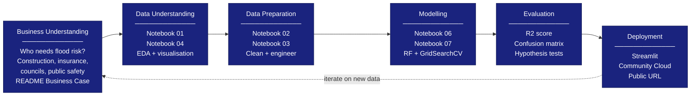

# CRISP-DM Process
## What this is
CRISP-DM (Cross Industry Standard Process for Data Mining) is the 
6-step framework used to structure this project. Each phase maps 
directly to one or more Jupyter notebooks in this project.

## Why it matters
Criteria 1.1 requires evidence that the project follows the 
Business Understanding phase of CRISP-DM by describing the dataset 
and business requirements. This diagram shows the full process 
and proves deliberate methodology was followed from data collection 
through to deployment.

## College criteria covered
- 1.1 CRISP-DM compliance 