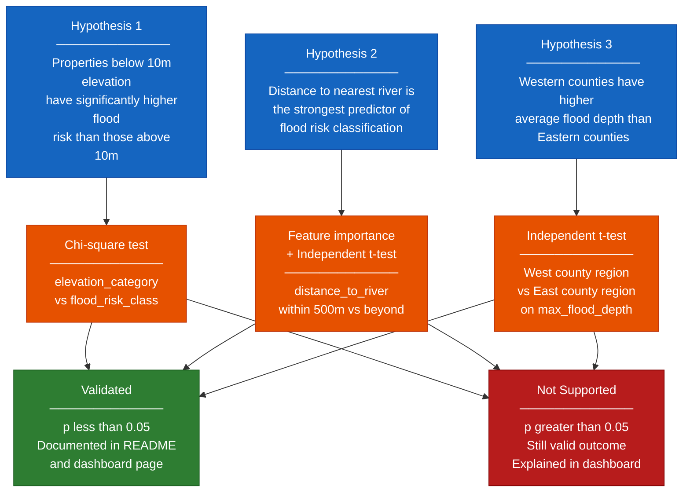

# Hypothesis Validation
## What this is
Three hypotheses about Irish flood risk were defined before 
modelling began. Each is tested using a statistical method 
appropriate to the variable types. Results are documented in 
Notebook 05 and displayed on the Hypothesis Validation 
dashboard page.

## Why it matters
- Criteria 1.2 (Merit) requires hypotheses stated in README
- Criteria 2.3 (Merit) requires statistical validation
- Criteria 4.3 (Merit) requires conclusions on dashboard
- Criteria D3 (Distinction) requires 3+ hypotheses validated
- A failed hypothesis is still valid — what matters is the 
  statistical test was run and the result is explained

