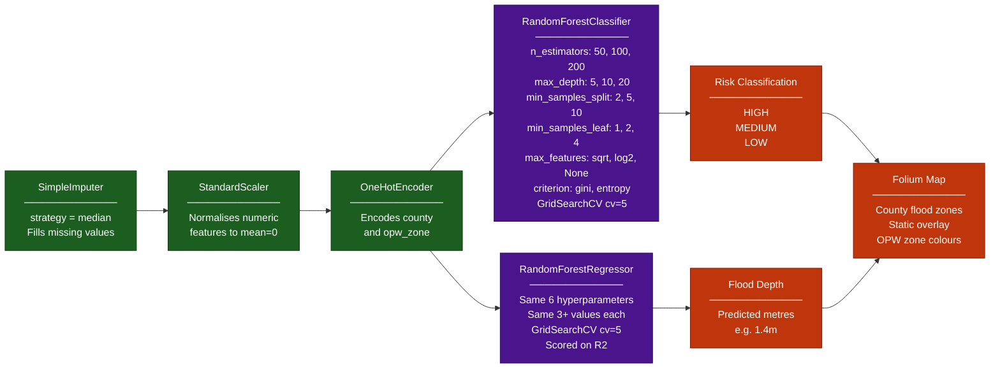

# ML Pipeline and Hyperparameter Tuning
## What this is
FloodSave uses two scikit-learn Random Forest pipelines: **one 
classifier for flood risk category** and **one regressor for flood 
depth**. Each pipeline includes preprocessing steps and was tuned 
using GridSearchCV across 6 hyperparameters with 3+ values each.

## Why it matters
- Criteria 5.1 (Pass) requires a modelling notebook with pipeline
- Criteria 5.2 (Pass) requires evaluation: R2 and confusion matrix
- Criteria 5.7 (Merit) requires documented hyperparameter tuning
- Criteria D4 (Distinction) requires 6+ hyperparameters with 3+ 
  values each AND rationale documented for every choice
- This is the hardest single distinction requirement — this diagram 
  proves every hyperparameter choice was deliberate

## Version A: Predictor page includes folium map
User enters county + elevation + distance to river
Model returns risk classification + flood depth
Static folium map shows flood zones for that county
Satisfies criteria 4.1, 5.4 and D7 (professional UX)
Makes this project genuinely publishable and bonus also interview-ready

## Hyperparameter rationale

| Parameter | Values | Why these values |
|-----------|--------|-----------------|
| n_estimators | 50, 100, 200 | 50 baseline, 100 standard, 200 for stability |
| max_depth | 5, 10, 20 | 5 prevents overfit, 20 allows complex patterns |
| min_samples_split | 2, 5, 10 | Higher values reduce overfitting on small groups |
| min_samples_leaf | 1, 2, 4 | Smooths the decision boundary progressively |
| max_features | sqrt, log2, None | sqrt standard RF, None uses all features |
| criterion | gini, entropy | gini faster, entropy considers more information |
