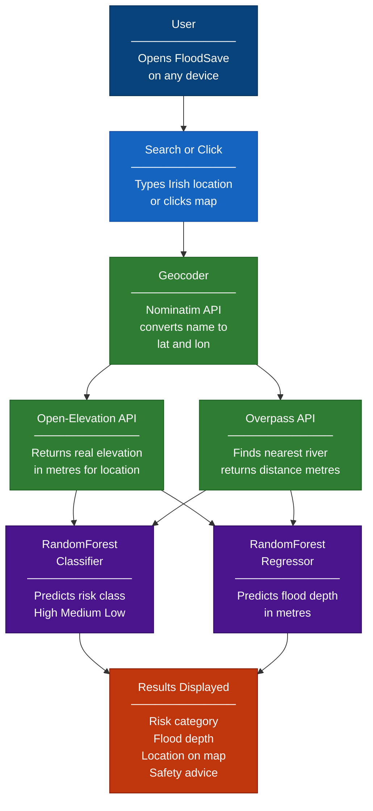

# FloodSave User Flow

```mermaid
flowchart TD
    classDef user    fill:#08427B,color:#fff,stroke:#052E56
    classDef action  fill:#1565C0,color:#fff,stroke:#0D47A1
    classDef api     fill:#2E7D32,color:#fff,stroke:#1B5E20
    classDef model   fill:#4A148C,color:#fff,stroke:#2A0A5A
    classDef result  fill:#BF360C,color:#fff,stroke:#7F1500

    U["User
    ─────────────
    Opens FloodSave
    on any device"]:::user

    S["Search or Click
    ─────────────
    Types Irish location
    or clicks map"]:::action

    G["Geocoder
    ─────────────
    Nominatim API
    converts name to
    lat and lon"]:::api

    E["Open-Elevation API
    ─────────────
    Returns real elevation
    in metres for location"]:::api

    R["Overpass API
    ─────────────
    Finds nearest river
    returns distance metres"]:::api

    M1["RandomForest
    Classifier
    ─────────────
    Predicts risk class
    High Medium Low"]:::model

    M2["RandomForest
    Regressor
    ─────────────
    Predicts flood depth
    in metres"]:::model

    O["Results Displayed
    ─────────────
    Risk category
    Flood depth
    Location on map
    Safety advice"]:::result

    U --> S --> G
    G --> E
    G --> R
    E --> M1
    E --> M2
    R --> M1
    R --> M2
    M1 --> O
    M2 --> O
```